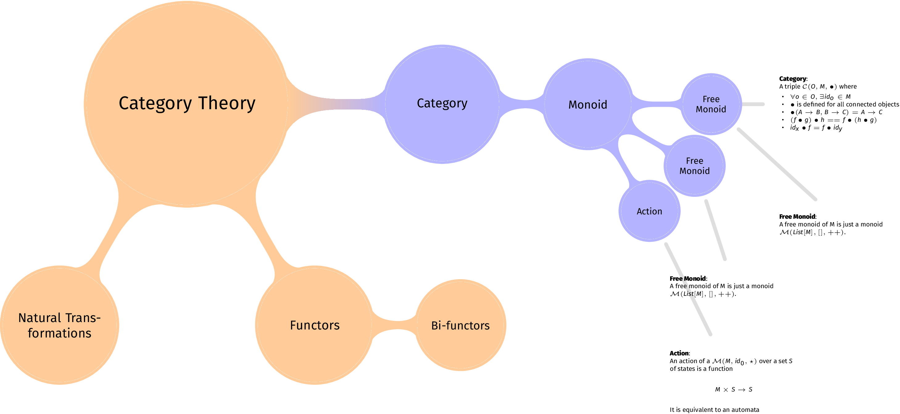

Pandoc-mm
=========

> Generate a mindmap from an org-mode file. Complete with annotations.

Foreword
========

This is just a tiny wrapper built on [the shoulders of a
giant](https://github.com/jgm/pandoc).

Example
=======

Generate this:



from this:

``` org
#+TITLE: Category Theory
#+AUTHOR: Vittorio Zaccaria
#+COLUMNS: %20ITEM %10color %10placement 
#+FONT: Fira Sans
#+MONOFONT: Inconsolata

* Category
:PROPERTIES:
:color: blue!30
:placement: ^^^
:END:       

A triple $\mathcal{C}(O, M, \bullet)$ where 

- $\forall o \in O, \exists id_o \in M$
- $\bullet$ is defined for all connected objects 
- $\bullet(A \rightarrow B, B \rightarrow C) = A \rightarrow C$
- $(f \bullet g) \bullet h == f \bullet (h \bullet g)$ 
- $id_x \bullet f = f \bullet id_y$

** Monoid 
:PROPERTIES:
:placement: VV
:END:

A monoid $\mathcal{M}(M, id_0, \star)$ is just a category $\mathcal{C}(O, M, \star)$ where O = { o_1 }

*** Free Monoid 
:PROPERTIES:
:placement: >>>
:END:

A free monoid of M is just a monoid $\mathcal{M}(List[M], [], ++)$. 

*** Action 
:PROPERTIES:
:placement: >>>
:END:

An action of a $\mathcal{M}(M, id_0, \star)$ over a set $S$ of states is a
function \[ M \times S \rightarrow S \]

It is equivalent to an automata
```

Installation
============

I'd strongly suggest to install it through
[Stack](https://docs.haskellstack.org/en/stable/README/):

``` sh
git clone https://github.com/vzaccaria/pandoc-mm.git
cd pandoc-mm 
stack install .
```

This should compile the binary and put it into something reachable in
your path. In my case this is `~/.local/bin`.

Usage
=====

        pandoc-mm FILE [ -x ]
        pandoc-mm --help | -h
        pandoc-mm --version

    Options:
        -x, --latex            Output raw latex
        -h, --help             Show help
        --version              Show version.

    Arguments
        FILE                   Org file containing the mindmap

Without the `-x` option, it generates a pdf with xelatex and pdfcrop.
Otherwise, it generates standalone latex you can compile with your own
toolchain.

Supported syntax
================

`:PROPERTIES:` can be the following:

-   `:color:` is any color in a syntax understandable by
    [Tikz](http://www.texample.net/tikz/). 
-   `:placement:` this chooses the position of the annotation with
    respect to the concept node, i.e.:

    -   '\^': above
    -   'V': below
    -   '&lt;': left
    -   '&gt;': right

    You can use max two, non conflicting directions. The number of
    symbols is used as distance; e.g.: `V>>>>` means
    `below right, node distance 5cm`.

*Warning*: it turns out that the official org-mode grammar does not accept spaces between properties, or between properties and headings. These are thus invalid headings:

```
* Category

:PROPERTIES:
:color: blue!30
:placement: ^^^
:END:       
```

or:
```
* Category
:PROPERTIES:
:color: blue!30

:placement: ^^^
:END:       
```


Faq
===

-   Why? Just for fun.
-   What about markdown? PR welcome!

